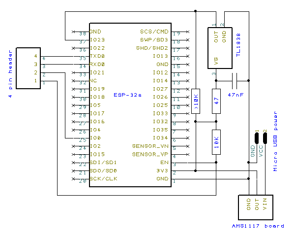

# ESP32 IR to KODI
Receive IR codes from your regular (TV) remote and turn it into Kodi commands to be send over WiFi

## Features
- Not specific to one remote: learn any remote you own
- Can be placed anywhere it can receive infra red from a remote: no need to physical connect to your Kodi setup
- Fully configurable through graphical user interface
- Send any [built-in Kodi command](http://kodi.wiki/view/List_of_built-in_functions) or add a custom command

## Hardware
You'll need some hardware in order to build this project:
- ESP32 (developed on an ESP-WROOM-32)
- Development board / burn fixture for the ESP32
- Universal IR Infrared Receiver (TL1838 VS1838B 1838 38Khz)
- 47 uF capacitor
- 47 Ohm resistor
- 10 KOhm resistor
- &gt; 10 KOhm resistor (I used 15KOhm)
- AMS1117 5v to 3v3 *
- 2x 22uF tantulum capacitor **
- 4 pin header *
- Micro USB molex *
- Breadboard / prototype PCB
- A computer or something to upload the sketch onto the ESP32
- WiFi with internet access
- ZeroConf support ***: [Avahi](http://www.avahi.org) for Linux, [Bonjour](http://support.apple.com/bonjour) for Windows, or [Bonjour HTTP Search](http://play.google.com/store/apps/details?id=jp.deci.tbt.andro.bonjoursearch) for Android

\* These parts are optional; no need if your ESP32 is soldered onto a development board  
\** Also optional; only needed when using a bare AMS1117 (I used an AMS1117 board)  
\*** Or you could figure out the IP and connect to it directly

## Building
Connect the parts according to the schematic below. This schematic is simply based on [two existing schematics](#schematics-and-libraries-used) found online

  
The AMS1117 used in this schematic is on a board together with some capacitors and some pins for through-hole connecting, when using a bare AMS1117 you'll have to add the capacitors yourself  
Get the code from *this repository*, either by cloning (`git clone https://github.com/BillyNate/ESP32-IR-to-KODI.git`) or by [downloading and extracting the .zip](https://github.com/BillyNate/ESP32-IR-to-KODI/archive/master.zip) to your Arduino sketchbook directory and upload the sketch to the ESP32

## Usage
- Start out by looking for a WiFi access point called `IR to KODI` and connect to it
- The access point is of the captive portal kind. Any current OS will show a pop-up telling you to log in, if not, open up your browser
- Enter the WiFi network the ESP32 should connect to and the IP and password of the Kodi setup in the network
- Copy over the mentioned host and save the settings
- Now connect yourself to the same network the ESP32 and the Kodi setup are on and go to copied host
- The configuration page should show itself now
- Press the `+` button to record a new IR code
- Select the Kodi command to be send to the Kodi setup once the same IR code is received again

## Schematics and libraries used
- [TL1838 cicruit on StackExchange](http://electronics.stackexchange.com/questions/68310/arduino-ir-practice-vs-application-circuit-on-1838-datasheets#answer-68315)
- [ESP32 wiring guide](http://www.14core.com/wiring-and-flashing-programming-esp-32-esp32s-with-usb-ttl-uart)
- [XBMC C++ EventClient](https://github.com/xbmc/xbmc/tree/master/tools/EventClients/lib/c%2B%2B)
- [RMT Ringbuffer example](https://github.com/pcbreflux/espressif/tree/master/esp32/arduino/sketchbook/ESP32_IR_Remote/ir_demo)
- [WifiManager](https://github.com/tzapu/WiFiManager/tree/esp32)

## License
[GPL](LICENSE)

## Contributing
1. Fork it!
2. Create your feature branch: `git checkout -b my-new-feature`
3. Commit your changes: `git commit -m 'Add some feature'`
4. Push to the branch: `git push origin my-new-feature`
5. Submit a pull request :)

Note: The code for the configuration webpage is in the `gh-pages` branch
